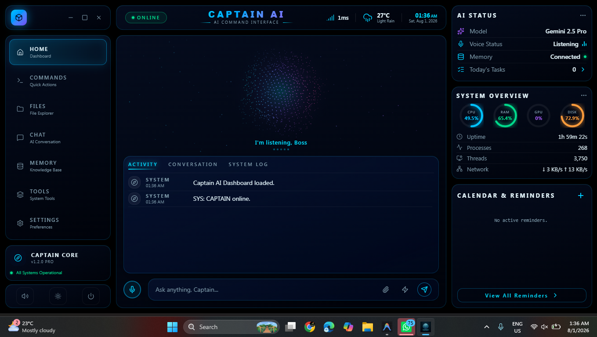
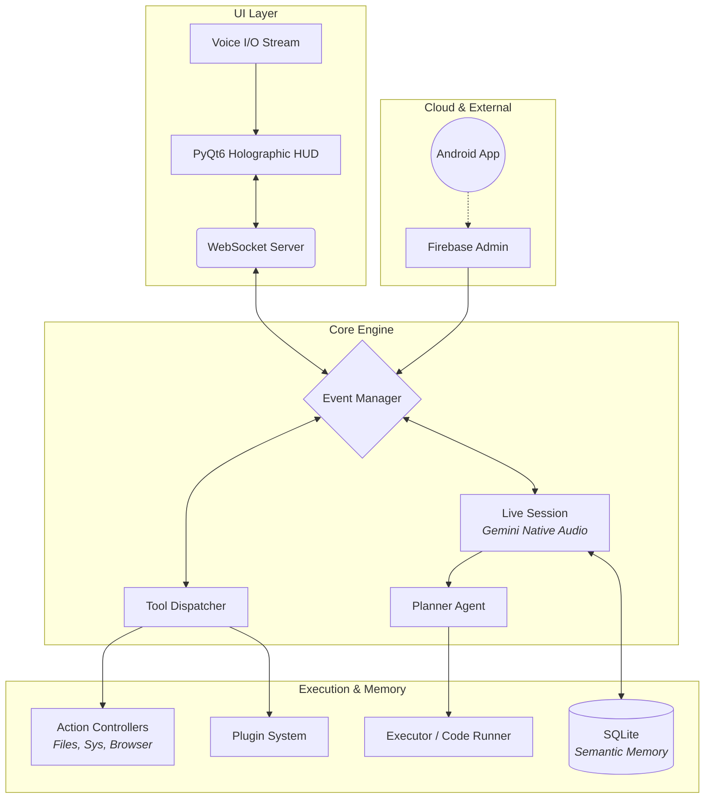

<div align="center">
  
  
  <br/>
  
  # ⚡ Captain AI Voice Assistant
  
  *A powerful, autonomous, desktop-based AI assistant integrated with **Gemini Live Audio**, **Firebase**, and deep local system controls.*

  <br/>

  [](https://python.org)
  [](https://riverbankcomputing.com/)
  [](https://aistudio.google.com/)
  [](https://firebase.google.com/)
  [](https://opensource.org/licenses/MIT)

  <br/>
  <p align="center">
    <a href="#-a-z-feature-set">✨ Features</a> •
    <a href="#-snapshots--gallery">📸 Gallery</a> •
    <a href="#-architecture">🏗️ Architecture</a> •
    <a href="#-installation">🚀 Installation</a> •
    <a href="#-project-structure">📂 Structure</a>
  </p>
</div>

---

**Captain AI** is an advanced voice-activated operating system agent built as a robust desktop application. It acts as a seamless bridge between your physical device, the cloud (Google Gemini & Firebase), and your mobile phone—all wrapped in a custom, responsive Iron Man-style holographic HUD.

---

## 📸 Snapshots & Gallery

<table align="center">
  <tr>
    <td align="center">
      
      <br/><b>Holographic Orb (Main UI)</b>
    </td>
    <td align="center">
      
      <br/><b>System Dashboard & Telemetry</b>
    </td>
  </tr>
  <tr>
    <td align="center">
      
      <br/><b>ChatInterface</b>
    </td>
    <td align="center">
      
      <br/><b>Setting and Configurations</b>
    </td>
  </tr>
</table>

---

## 🌟 A-Z Feature Set

Captain AI comes packed with a massive array of capabilities directly integrated into your operating system.

### 🧠 Intelligence & Memory
- **Autonomous Planning (`planner.py`):** Breaks complex instructions into multi-step JSON execution trees.
- **Cognitive Vision (`screen_processor.py`):** Takes screenshots, runs OCR, and understands visual context on your screen.
- **Offline Mode (`offline_parser.py`):** Zero-dependency local command engine — handles 50+ hardcoded commands (media, files, hotkeys, system) instantly with no internet and zero CPU overhead.
- **Neural Memory (`memory/`):** Powered by SQLite for permanent semantic recall of facts and user preferences.
- **Real-time Native Audio (`live_session.py`):** True streaming conversations utilizing Gemini's low-latency audio API.

### 💻 System & Device Control
- **App Management (`open_app.py`):** Automatically finds and launches desktop applications.
- **Automation & Macros (`computer_use.py`, `computer_control.py`):** Mouse, keyboard, hotkeys (Ctrl+C/V, Win+R, Alt+Tab, etc.), clicking by visual description, and shortcut automation.
- **Computer Settings (`computer_settings.py`):** Granular control over Bluetooth, Wi-Fi, dark mode, window management, and display configurations.
- **Hardware Control:** Adjust volume, screen brightness, and fetch real-time system metrics (CPU/RAM/Battery).

### 📁 File & Code Operations
- **Code Helper & Dev Agent (`code_helper.py`, `dev_agent.py`):** Write, run, debug Python scripts locally in an isolated sandbox.
- **Advanced File Management (`file_controller.py`):** Search, create, move, and organize OS directories with deep drive indexing.
- **File Processing (`file_processor.py`):** Read and extract data directly from PDFs, text files, and images.

### 🌐 Web & Media
- **Playwright AI Browser (`browser_agent.py`):** A persistent, stateful Playwright browser engine that runs in the background. Saves your login sessions across restarts.
- **True Background Media Control:** Captain injects JavaScript directly into the Playwright browser — skip/pause/play YouTube even when the window is minimized or on a different monitor, with zero keyboard simulation.
- **Web Browsing (`web_search.py`):** Integrated live web search for pulling recent data.
- **Weather API (`weather_report.py`):** Pull real-time weather and forecast data.

### 📱 Connectivity & Social
- **Cross-Device Mobile Link (`phone_agent.py`):** Sync notifications, SMS, battery data, and remote commands via Firebase.
- **Messaging (`send_message.py`):** Automate sending messages across supported platforms.
- **Reminders (`reminder.py`):** Set local timers, alarms, and semantic reminders.

---

## 🏗️ Architecture

Captain AI leverages a highly modular event-driven architecture, enabling the AI to pause, execute local code, and resume reasoning gracefully.



---

## ⚡ Standalone Executable (Ready to Use)

Not a developer? You don't need Python to run Captain AI! 
A pre-compiled standalone executable is available.

Simply navigate to the `dist` folder and run the application directly:
**Path:** `dist/Captain/Captain.exe`

> *Note: Make sure your `.env` configuration file is properly set up in the same directory as the executable.*

---

## 🚀 Installation (For Developers)

### Prerequisites
- **Python 3.10+**
- **Google AI Studio API Key**
- **Firebase Project** with Realtime Database enabled

### 1. Clone & Setup
```bash
git clone https://github.com/RaviKurane17/Main_Captain.git
cd Main_Captain
pip install -r requirements.txt
```

### 2. Environment Configuration
Create a `.env` file in the root directory:
```env
GEMINI_API_KEY=your_gemini_key_here
FIREBASE_KEY_PATH=/absolute/path/to/firebase-adminsdk.json
PHONE_DEVICE_ID=your_android_uuid_here
```

### 3. Launch Captain AI
```bash
python main.py
```
> **Note:** On first launch, the system will initialize databases and prompt for a biometric scan.

---

## 📂 Comprehensive Project Structure

Captain AI is engineered with a modular, highly scalable codebase. Here is the deep-dive structure of the project:

```text
Captain_AI_UI/
├── main.py                     # 🏁 Application Entry Point (Starts UI & Core)
├── build_exe.py                # 📦 Script to compile the project to an EXE
├── Captain.spec                # 📄 PyInstaller specification file
├── .env                        # 🔐 Environment Variables (API Keys, Paths)
│
├── ⚙️ core/                      # Core Application Logic
│   ├── captain_app.py          # Main application controller
│   ├── live_session.py         # Gemini Native Audio integration & WebRTC
│   ├── websocket_server.py     # Communication bridge between Engine & UI
│   ├── event_manager.py        # Centralized Event Bus for cross-module messaging
│   └── tool_dispatcher.py      # Maps LLM tool requests to local Python functions
│
├── 🧠 agent/                     # Cognitive Agents & Planning
│   ├── planner.py              # Breaks down complex instructions into tasks
│   ├── executor.py             # Executes planned JSON execution trees
│   └── task_queue.py           # Thread-safe background task manager
│
├── 🛠️ actions/                   # 18+ Distinct Capability Modules (A-Z)
│   ├── computer_control.py     # System (Volume, Brightness, Metrics)
│   ├── file_controller.py      # File & Directory operations
│   ├── phone_agent.py          # Firebase Realtime DB (Phone Link)
│   ├── web_search.py           # Internet browsing & parsing
│   ├── dev_agent.py            # Code execution sandbox
│   └── screen_processor.py     # Visual OCR & Screen context
│
├── 🗃️ memory/                    # Persistent State
│   └── SQLite stores for semantic recall & vectors
│
├── 🎨 ui/                        # User Interface Layer
│   └── memory_page.py          # PyQt6 holographic components & dashboard
│
├── 🧩 plugins/                   # Extensibility
│   ├── example_plugin.py       # Template for adding new tools
│   └── mic_control_plugin.py   # Microphone toggles
│
├── 🔧 utils/                     # Helpers
│   ├── config.py               # Configuration loader
│   ├── logger.py               # Centralized rotating loggers
│   └── analytics.py            # Performance tracking
│
├── 🌐 frontend/                  # Web Dashboard & Companion UI
│   ├── src/                    # React/Vite source code
│   ├── package.json            # Web dependencies
│   └── vite.config.ts          # Vite bundler configuration
│
└── 📦 dist/Captain/              # Pre-compiled Standalone Executable
    └── Captain.exe             # Ready-to-use Windows App
```

---

## ⚖️ License

This project is licensed under the MIT License - see the [LICENSE](LICENSE) file for details.

---

## 👨‍💻 Let's Connect!

Designed and engineered by **Ravindra Kurane**. If you like this project, feel free to reach out or check out my other work!

<div align="left">
  <a href="https://github.com/RaviKurane17" target="_blank">
    
  </a>
  <a href="https://instagram.com/your_insta_handle" target="_blank">
    
  </a>
  <a href="https://ravikurane17.netlify.app" target="_blank">
    
  </a>
</div>

<br/>
<div align="center">
  <i>"I'm awake, Captain."</i>
</div>
